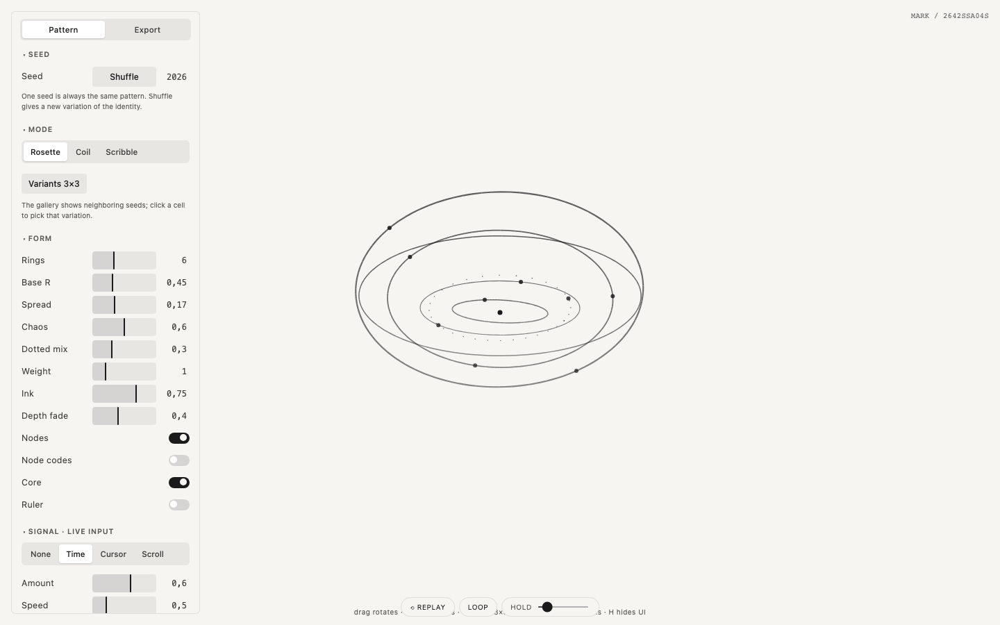

  

<h1 align="center">Logomachine</h1>

  Seeded generative marks: one seed, one pattern, always 
  one HTML file · runs in the browser · no install · free and open source

  <a href="https://robvagin-beep.github.io/logomachine/"><b>Open Logomachine</b></a> ·
  <a href="#run-it">Run it</a> ·
  <a href="#more-tools">More tools</a>

---

A machine for marks. Every seed is a pattern you can come back to; Shuffle finds the next one, and a 3×3 gallery shows its neighbors.

## What it does

- **Modes:** Rosette, Coil and Scribble
- **Seed and Shuffle:** the same seed always gives the same mark; Variants 3×3 shows the neighboring seeds
- **Live signal:** the mark opens with time, with the cursor or with the scroll wheel
- **Motion pad** for tempo and character, a camera to turn the form
- **Export:** SVG for print, decks or a favicon, PNG and a JSON config

## Run it

Open [robvagin-beep.github.io/logomachine](https://robvagin-beep.github.io/logomachine/), or download `index.html` and open it from your disk. It is the whole tool: no build step, no dependencies, no network. Press **H** to hide the panel.

## Made by a designer

I'm a designer. I build small tools like this for my own work, with AI agents: I make the decisions, Claude Code writes the code. The panels follow one grammar across the whole set.

Take it if you want it.

## More tools

- [Particle Dance](https://github.com/robvagin-beep/particle-dance) · particles that dance along patterns and 3D forms
- [Murmur](https://github.com/robvagin-beep/murmur-vj) · a VJ visualizer: circles, triangles and squares that move to your music
- [Orbital](https://github.com/robvagin-beep/orbital) · data as orbits, axes or a bending mesh
- [Metaballs](https://github.com/robvagin-beep/metaballs) · soft masses that merge, split and leave holes
- [Halftone Cloud](https://github.com/robvagin-beep/halftone-cloud) · images rebuilt as a halftone of flying shapes
- [Motion Primer](https://github.com/robvagin-beep/motion-primer) · bodies with behaviors: swarm, pack, magnet, orbit, fall, scatter
- [Particles 3D](https://github.com/robvagin-beep/particles-3d) · a WebGL2 cloud of up to 300,000 particles
- [Pixel Ring](https://github.com/robvagin-beep/pixel-ring) · rings drawn in pixels
- [Motion Pad](https://github.com/robvagin-beep/motion-pad) · one pad for the character of motion

## License

[MIT](LICENSE) © 2026 Robert Vagin
